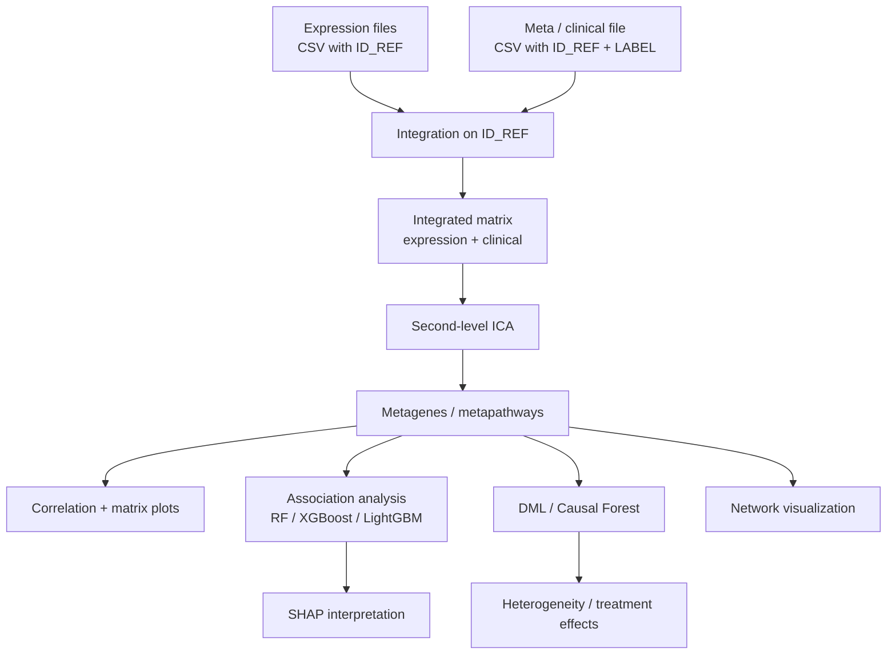

# RNAchat input formats (from repo code)

## Where the database lives
- The project uses Django persistence, with the default local database configured as SQLite (`db.sqlite3`) in the Django settings.
- The main data tables are defined in `IMID/models.py` and created by `IMID/migrations/0001_initial.py`.
- Runtime state is also serialized per user/session into `ProcessFile` records.
- Uploaded files are stored through `UploadedFile`, `SharedFile`, and `SharedFileInstance` models.

Evidence:
- The README setup instructions show `DATABASES = {'default': {'ENGINE': 'django.db.backends.sqlite3', 'NAME': BASE_DIR / "db.sqlite3"}}`.
- `IMID/models.py` defines `UploadedFile`, `MetaFileColumn`, `ProcessFile`, `SharedFile`, `SharedFileInstance`, and `userData`.

## Pipeline overview
1. Upload expression files.
2. Upload one meta / clinical file.
3. Integrate expression + clinical data on `ID_REF`.
4. Run ICA to generate metagenes / metapathways.
5. Run visualization, association analysis, SHAP, and DML.
6. Optionally export metagenes and other results.

Where this happens in code:
- Upload endpoints: `IMID/views.py` (`opExpression`, `opMeta`).
- Integration: `IMID/tasks.py` (`runIntegrate`) and `IMID/utils.py` (`integrateExData`, `integrateCliData`).
- ICA / metapathways: `IMID/views.py` (`ICAreport`) and `IMID/utils.py` (`ICA`).
- ML and DML: `IMID/views.py` (`goML`, `goDML`) and helper functions in `IMID/utils.py`.

## Methodology summary
- Data model: expression matrix + clinical table, joined by `ID_REF`.
- Feature construction: second-level ICA over integrated data to form metagenes / metapathways.
- Supervised analysis: Random Forest, XGBoost, and LightGBM with SHAP explanations.
- Causal / heterogeneity analysis: Double Machine Learning with Causal Forests.
- Visualization: correlation matrix, matrix plots, network plots, and SHAP importance plots.

Important code signals:
- `IMID/utils.py` uses `StabilizedICA` for ICA.
- `IMID/views.py` and `IMID/templates/tab1.html` describe the workflow as upload -> integrate -> ICA -> visualise -> association -> DML.
- The README frames the method as an interactive platform for metapathway analysis from clinical and multi-omics data.

## Brief of the paper
- RNAchat is an interactive web platform for analyzing clinical and multi-omics data through metapathways.
- The core idea is to compress expression data into ICA-derived metagenes, then model how those metapathways relate to phenotypes.
- It supports visualization, supervised prediction, SHAP-based interpretation, and DML-based heterogeneity analysis.
- The paper demonstrates the workflow on cases such as drug response, host-parasite interaction, and rheumatoid arthritis versus metabolic syndrome.
- In practical terms, it is designed for questions like "which pathway modules matter for a phenotype?" rather than direct ligand-receptor communication.

## Required inputs

### Expression (gene expression / ICA-preprocessed) file
- File type: CSV is assumed (files are read with `pd.read_csv(...)`).
- Required column: `ID_REF` must exist in each expression file.
- Other columns: gene expression values or ICA-derived component values; duplicates are not allowed.
- One file is stored per upload in current code path, even if UI mentions multiple.

Evidence:
- Upload checks `ID_REF` for expression files (see `UploadFileColumnCheck` in IMID/utils.py).
- UI hints: "Upload csv (bulked) RNA-seq Files, each file needs to include ID_REF".

### Meta / clinical file
- File type: CSV is assumed.
- Required columns: `ID_REF` and `LABEL`.
- Optional columns: clinical variables; numeric columns are treated as numeric features.
- `LABEL` is used for visualization and as a default label for ML.

Evidence:
- Meta file is validated with `UploadFileColumnCheck(df, ("ID_REF", "LABEL"))`.
- UI hints: "Upload a csv meta-data File, each file needs to include ID_REF and LABEL, may include some clinic data (numeric)".

## How files are integrated
- Expression files are inner-joined to meta/clinical data using `ID_REF`.
- The pipeline first reads meta data, then joins expression data, then creates an integrated dataset.
- `LABEL` is used to tag batches/classes during integration (used for ML/DML workflows).

Evidence:
- Integration logic in `runIntegrate` and `integrateExData` uses `ID_REF` for inner-joins.

## Constraints and practical notes
- Duplicate columns are rejected by `UploadFileColumnCheck`.
- If `ID_REF` values do not overlap between meta and expression, integration fails with "No matched data for meta and omics".
- File names are used to derive batch labels (based on filename segments).

## Source files reviewed
- IMID/utils.py (upload checks, meta/expression preview, integration)
- IMID/views.py (upload endpoints and required column docstrings)
- IMID/tasks.py (integration workflow)
- IMID/templates/tab1.html (UI hints for required columns)

## Compatibility note (from this repo)
- RNAchat expects ICA-processed expression matrices or raw expression that can be used for ICA inside the app.
- If you have spatial proteomics, you likely need to map proteins to gene identifiers and form a matrix with `ID_REF` to match expected format.

## RNAchat vs CellChat v2

### Main difference
- RNAchat is a broader clinical multi-omics analysis platform centered on ICA-derived metapathways, phenotype association, SHAP, and DML.
- CellChat v2 is a cell-cell communication framework centered on ligand-receptor inference from scRNA-seq and spatial transcriptomics.

### Where RNAchat is stronger
- Better if the goal is to connect pathways to clinical variables such as response, severity, age, or batch-like phenotypes.
- Better for supervised analysis, interpretation of metapathways, and downstream predictive modeling.
- More flexible for mixed clinical tables because it explicitly integrates expression with clinical metadata on `ID_REF`.

### Where CellChat v2 is stronger
- Better if the goal is direct cell-cell communication inference.
- Better for ligand-receptor biology, including curated signaling databases and spatially proximal communication.
- Better for datasets where cell types and spatial context are the primary question.

### RNAchat pros
- Works with clinical covariates and phenotype prediction in one workflow.
- Combines pathway-level decomposition with ML interpretability.
- Can use DML / causal forest style analysis for heterogeneity questions.

### RNAchat cons
- Depends on ICA-style preprocessing and a compatible `ID_REF`-based table structure.
- Not a direct ligand-receptor communication engine.
- Less suitable if the main question is cell-cell signaling rather than phenotype-linked pathway structure.

### CellChat v2 pros
- Specialized for cell-cell communication and signaling network analysis.
- Strong for scRNA-seq and spatial transcriptomics.
- Curated database coverage, including CellChatDB v2 extensions for protein and non-protein interactions.

### CellChat v2 cons
- More focused on communication inference than clinical prediction.
- Less suited for direct supervised modeling of outcomes like age, severity, or treatment response.
- Requires cell-level or spatial transcriptomics structure rather than the RNAchat-style ICA + clinical table input.

